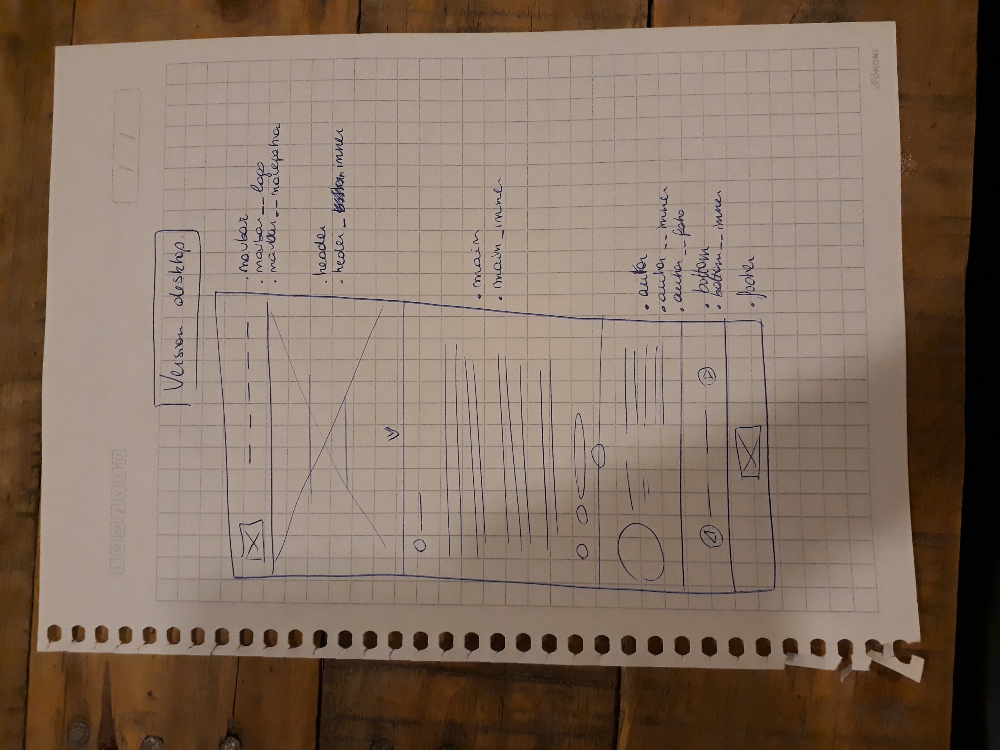
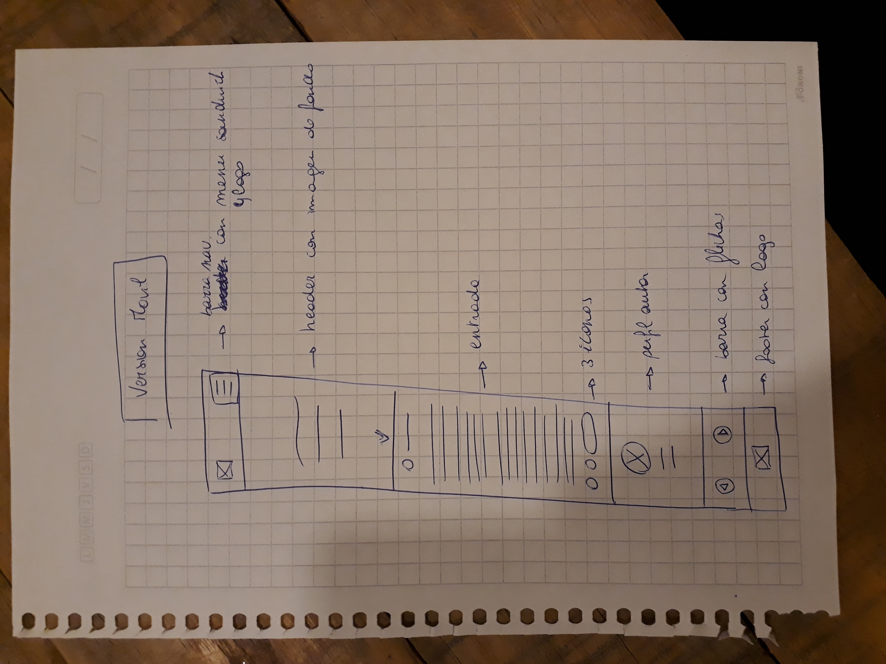

# Maquetación

## Pre-maquetado de página Barbershop

### Requisitos generales:
-Una entrada de blog que contiene:
	- Una barra de navegación
	- Un header
	- Una entrada
	- El perfil del autor del artículo
	- Una barra con flechas que permitan ir a las entradas anteriores y siguientes
	- Un footer
		
### Requisitos específicos:
	- Iconos con background gris
		- *usar repositorio "font-awesome"*
	- Párrafos en general
		- *usar lorem ipsum en lugares sin contenidos fijos. *
	- Barra de navegación con logo y 5 items
		-*Usar bootstrap*
	- Secciones con grilla 
		- *usar bootstrap*
	- Botones
		- *usar bootstrap*

### Requisitos visuales:
	- layout:
		- Para crear layout usar Bootstrap
	- Fuentes: Buscar en Google Fonts
		- Navbar y bottom: Roboto-regular
		- Header: Fairplay-Display Blackitalic
		- Main y Autor: Roboto-light
		- Nombre del autor en sección autor: Fairplay-Display Regular
	- Color: 
		- Navbar y footer: #FFFFFF
		- Header: #FFFFFF
		- Main: #323333 y #D56C6A 
		- Autor: #323333
		- Bottom: #323333
	- Background color: 
		- Navbar y footer: #121619
		- Main: #FFFFFF
		- Autor: #FFFFFF
		- Bottom: #707070 
	- Imagenes:
		- Las imagenes se encuentran dentro de la carpeta assets/img
	- Iconos: 
		- Para buscar iconos, usar font awesome

### Sketch para desktop y mobile
Desktop: 
Mobile: 
